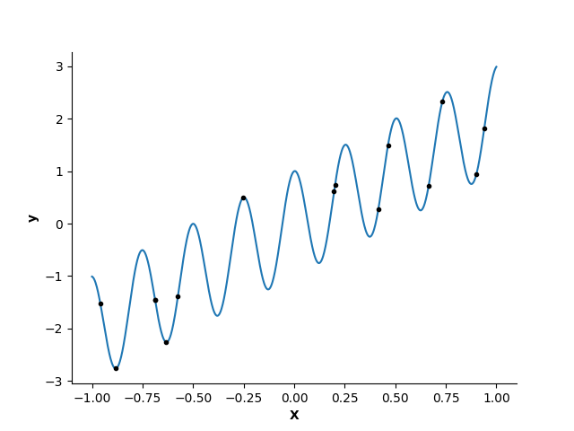

# Double descent: Gauging underfitting versus overfitting

In this practical session, we will focus on constructing validation curves for
a simple prediction task on simulated data. This approach allows us to
evaluate model performance across different parameter settings, helping us
better understand model behavior and generalization.

In supervised learning, our typical setup involves a dataset containing $N$
 training samples: $\mathcal{D} = \{(x_n, y_n)\}_{n=1}^N$, where each
sample consists of an input $x_n$ and its corresponding output $y_n$.
Our objective is to leverage this dataset $\mathcal{D}$ to identify a
function $f$ such that $f(x) \approx y$ for new, unseen data.

For a simple linear regression, we assume that $f$ is a linear function,
specifically of the form $f(x) = \beta x$. However, in this session, we’ll
take a step further by exploring polynomial regression. Our aim here is to
predict $y$ based on $x \in \mathbb{R}$, where $x$ lies within the
interval $[-1, 1]$. The true, unknown relationship between $x$ and $y$
in this setting is defined as:

$$
y(x) = 2x + \cos(25x)
$$

In polynomial regression, we map each data point $x$to a higher-dimensional
space to better capture the underlying complexity of the relationship.
Specifically, we transform each $x$ into a $P$-dimensional feature space by
applying a "feature map" $\phi_P: \mathbb{R} \rightarrow \mathbb{R}^P$. This
transformation allows us to model more complex, non-linear relationships in
the data by fitting a polynomial function of degree $P$.

Through this practical session, we will analyze how different choices of $P$,
the number of polynomials, affect the model’s accuracy on training versus
validation data, enabling us to plot validation curves and observe overfitting
and underfitting patterns.

1. Generate data from the model describe above, using $N=15$: first, sample x
   randomly from [-1, 1]. Then apply the function $y(x)$ on the samples drawn.

   Plot the function y(x) and the sampled data points.

2. Create a Python function `create_feature_map(x, p)`( (where X is a 1D numpy
   array, and p the number of polynomials) to create a feature map with
   varying number of polynomials. You can use any type of polynomial
   (Legendre, Laguerre, etc).
   
   Tip: look at `np.polynomial.legendre.Legendre.basis` or
   `np.polynomial.chebyshev.Chebyshev.basis`

3. Using `sklearn.LinearRegression`, fit the model using 5 features. 

   Visualize predictions over 1000 points linearly spaced between -1 and 1
   (tip: `np.linspace`)

4. Do the same with different number of polynomials (for example, 2, 5, 10, 15). What do you observe?

5. Plot validation curves by computing the mean squared error of the
   predictions (1) on the training data and (2) on the 1000 data points
   linearly spaced between -1 and 1 as a function of the number of parameters.

   Add a vertical line on the *Interpolation threshold*, where $N = P$.

   Identify underfitting and overfitting region of the validation curves.

   Comment the results
   
6. Repeat the experiments with different datapoints sampled from the same
   function to add error bars / intervals to the validation curves.

7. Now, increase the range of the parameters you test from 2 to 40. (If
   necessary, decrease the number of repeats to get the error bars)

   Identify the underparametrized and overparametrized region.

   Comment the results.
